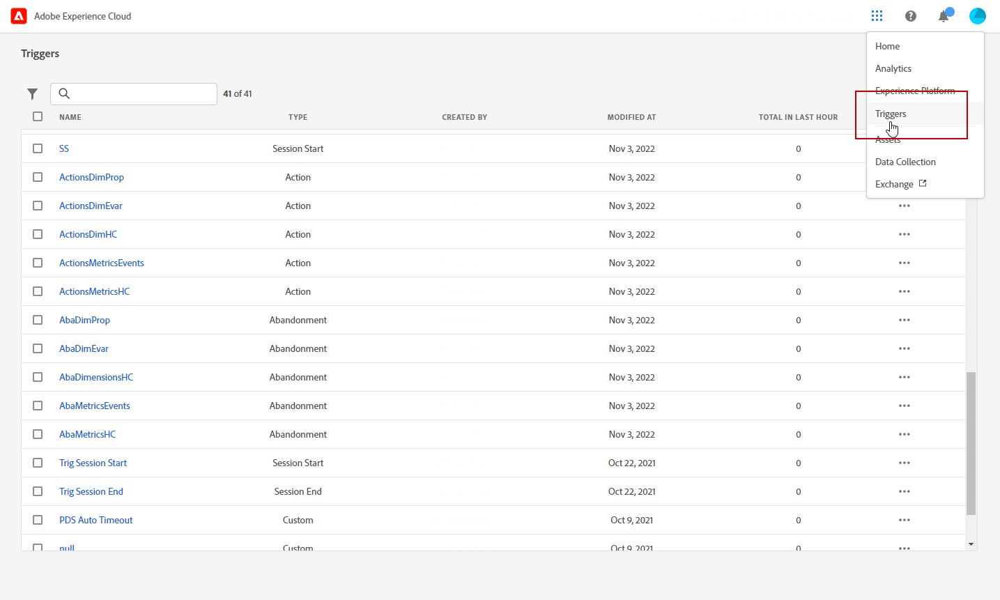
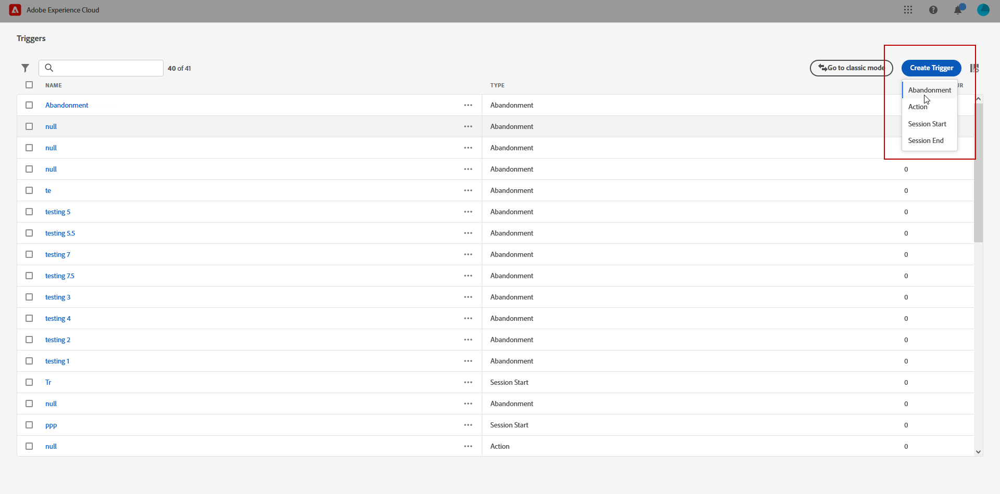
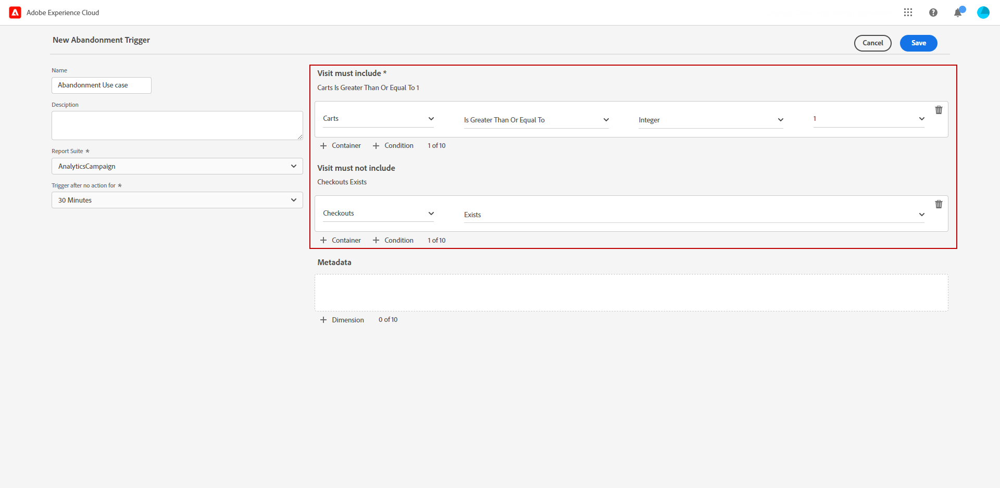
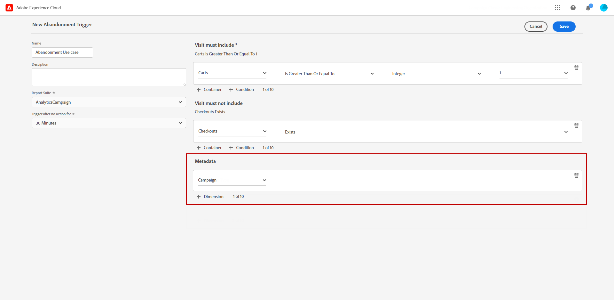
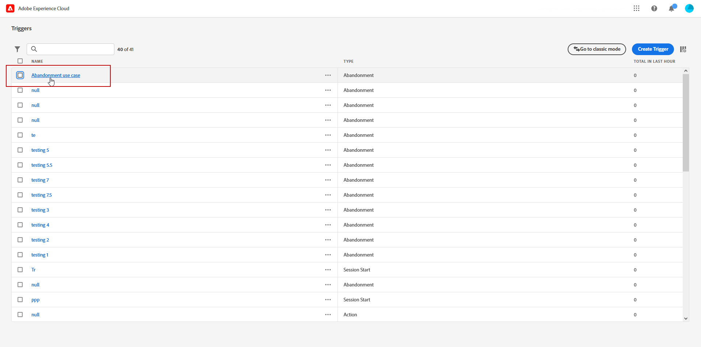
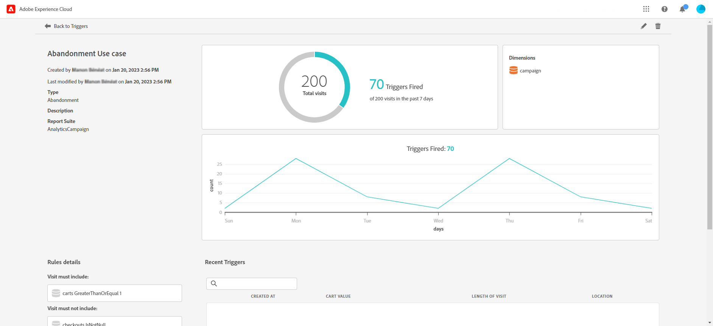

# Een Experience Cloud-trigger maken {#create-triggers}

>[!NOTE]
>
> De nieuwe gebruikersinterface voor Experience Cloud Triggers biedt een intuïtieve ervaring om consumentengedrag te beheren en de gebruikerservaring aan te passen. Als u wilt terugschakelen naar de vorige interface, klikt u op de knop **[!UICONTROL Go to classic mode]** knop.

Maak een trigger en configureer de voorwaarden voor de trigger. U kunt bijvoorbeeld de criteria voor de regels van een trigger tijdens een bezoek opgeven, zoals maateenheden zoals Kart Abandon of afmetingen zoals de productnaam. Wanneer aan de regels wordt voldaan, loopt de trekker.

1. Selecteer in de Experience Cloud het geavanceerde menu en vervolgens Triggers.

   

1. Klik op de startpagina **[!UICONTROL Create Trigger]** geeft u vervolgens het type trigger op.

   Er zijn drie typen triggers beschikbaar:

   * **[!UICONTROL Abandonment]**: U kunt een trigger maken die moet worden geactiveerd wanneer een bezoeker een product weergeeft, maar er niets aan toevoegt.

   * **[!UICONTROL Action]**: U kunt bijvoorbeeld triggers maken om na aanmelding voor nieuwsbrieven, e-mailabonnementen of aanvragen voor creditcards (bevestigingen) te activeren. Als u een detailhandelaar bent, kunt u een trekker voor een bezoeker tot stand brengen die zich voor een loyaliteitsprogramma ondertekent. In media en vermaak, creeer trekkers voor bezoekers die op een bepaalde show letten, en misschien wilt u met een onderzoek antwoorden.

   * **[!UICONTROL Session Start and Session End]**: Maak een trigger voor het starten en beëindigen van de sessie.

   

1. Voeg een **[!UICONTROL Name]** en **[!UICONTROL Description]** aan uw trekker.

1. Analyses selecteren **[!UICONTROL Report Suite]** wordt gebruikt voor deze trigger. Deze instelling identificeert de te gebruiken rapportgegevens.

   [Meer informatie over de rapportsuite](https://experienceleague.adobe.com/docs/analytics/admin/admin-tools/manage-report-suites/c-new-report-suite/t-create-a-report-suite.html).

1. Kies de optie **[!UICONTROL Trigger after no action for]** geldigheidsperiode.

1. Van de **[!UICONTROL Visit must include]** en **[!UICONTROL Visit must not include]** categorieën kunt u criteria of gedrag van bezoekers definiëren die u wilt of niet wilt gebruiken. U kunt **en** of **of** de logica binnen of tussen voorwaarden, afhankelijk van de criteria u bepaalt.

   De regels voor een eenvoudige trigger voor het verlaten van een winkelwagentje kunnen bijvoorbeeld zijn:

   * **[!UICONTROL Visit must include]**: `Carts (metric) Is greater or equal to 1` om bezoekers met ten minste één artikel in hun winkelwagentje aan te spreken.
   * **[!UICONTROL Visit must not include]**: `Checkout (metric) Exists.` om bezoekers die de artikelen in hun winkelwagentje hebben gekocht, te verwijderen.

   

1. Klikken **[!UICONTROL Container]** om regels, voorwaarden of filters te maken en op te slaan die een trigger definiëren. Als u wilt dat gebeurtenissen tegelijkertijd plaatsvinden, plaatst u ze in dezelfde container.

   Elke container verwerkt onafhankelijk op raakniveau. Dit houdt in dat als twee containers zijn aangesloten bij de **[!UICONTROL And]** exploitant, de regels zullen slechts in aanmerking komen wanneer twee treffers aan de vereisten voldoen.

1. Van de **[!UICONTROL Metadata]** veld, klikken **[!UICONTROL + Dimension]** om een bepaalde campagnedimensie of variabelen te kiezen die relevant zijn voor het gedrag van de bezoeker.

   

1. Klik op **[!UICONTROL Save]**.

1. Selecteer uw nieuw gemaakte **[!UICONTROL Trigger]** van de lijst om tot het detailrapport van uw trekker toegang te hebben.

   

1. Vanuit de gedetailleerde weergave van de trigger hebt u toegang tot de rapporten over het aantal triggers dat is geactiveerd. Indien nodig kunt u de trigger bewerken met het potloodpictogram.

   
